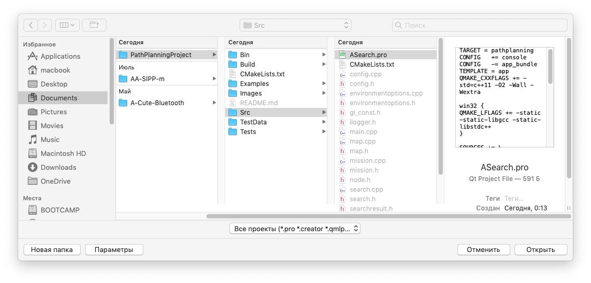
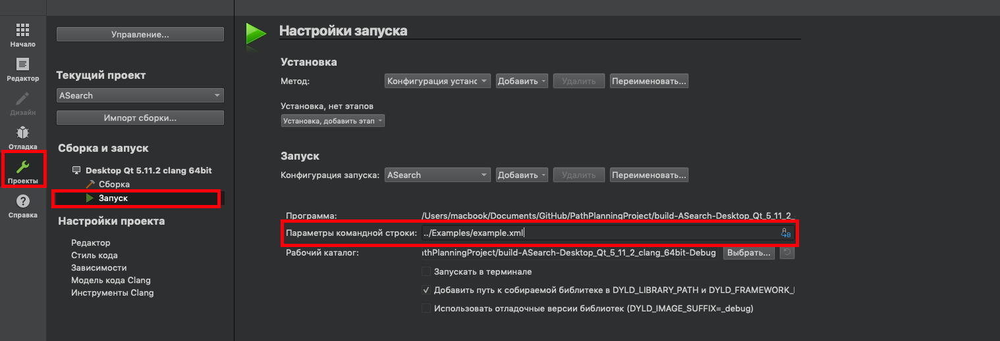
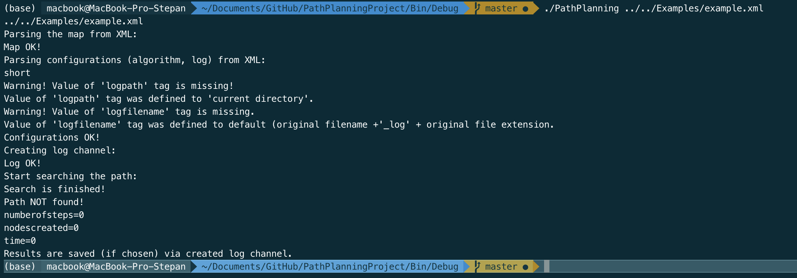
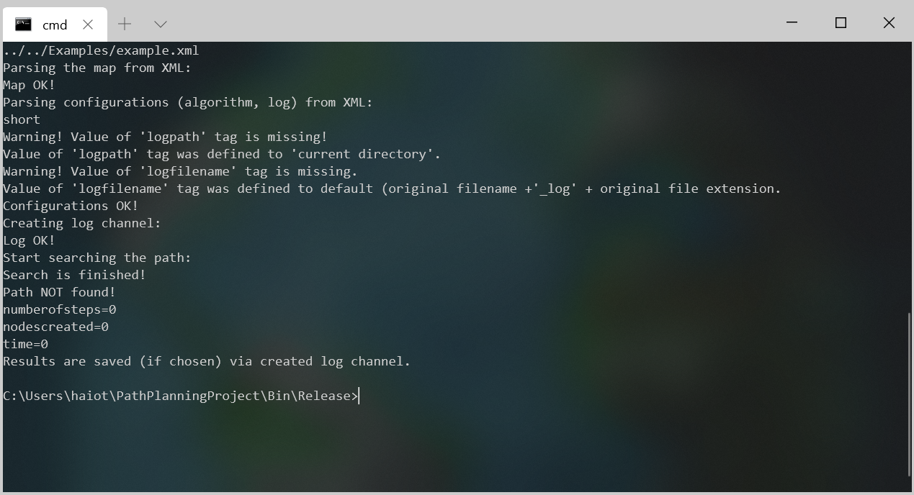

# PathPlanningProject
Шаблон исходного кода для выполнения проекта по планированию траекторий.


## Требования
Для работы над проектом требуется иметь аккаут GitHub.

Для сборки и запуска возможно использовать QMake или CMake. CMakeLists.txt и .pro файлы доступны в репозитории. Для проведения тестирования локально испольщуйте CMake. Подробные требования к ПО указаны ниже. 

Используемая версия языка - C++20.

### Linux
- Git 2.7.4 или выше
- CMake 3.2 или выше;
- GCC 4.9 или выше;
- Make
- QtCreator и Qt5 (по желанию).

### Mac
- Git 2.23.0 или выше
- CMake 3.2 или выше;
- Apple LLVM version 10.0.0 (clang-1000.11.45.5) или выше;
- Make
- QtCreator и Qt5 (по желанию).

### Windows
- Git 2.23.0 или выше
- CMake 3.2 или выше;
- MinGW-w64 5.0.3 или выше (должен быть добавлен в переменную среды Path);
- QtCreator и Qt5 (по желанию).

## Начало работы
Cоздайте ответвление (fork) этого репозитория в свой GitHub аккаунт. Загрузите содержимое полученного репозитория, либо клонируйте его в нужную вам директорию.
```bash
git clone https://github.com/*account*/PathPlanningProject.git
```

### Сборка и запуск

Сборку проекта возможно осуществить двумя способами:
- Используя QtCreator и qmake;
- Используя CMake.
  
При использовании QtCreator требуется открыть файл `ASearch.pro` который находится в директории `.../PathPlanningProject/Src/` и настроить проект с нужным комплектом сборки.



После выбора проекта требуется установить имя входного файла как аргумент командной строки. В качестве первого примера используйте файл `.../PathPlanningProject/Examples/example.xml`. Для установки аргументов командной строки перейдите в настройки запуска проекта и введите нужный путь к файлу в поле "Параметры командной строки".



После установки аргумента командной строки можно проверить работу программы. Следующий результат должен отобразиться в результате запуска:

```
Parsing the map from XML:
Map OK!
Parsing configurations (algorithm, log) from XML:
short
Warning! Value of 'logpath' tag is missing!
Value of 'logpath' tag was defined to 'current directory'.
Warning! Value of 'logfilename' tag is missing.
Value of 'logfilename' tag was defined to default (original filename +'_log' + original file extension.
Configurations OK!
Creating log channel:
Log OK!
Start searching the path:
Search is finished!
Path NOT found!
numberofsteps=0
nodescreated=0
time=0
Results are saved (if chosen) via created log channel.
```

При использовании CMake сборка и запуск может производиться как из командной строки, так и при помощи различных IDE (например JetBrains CLion). Ниже приведены скрипты сборки и запуска с использованием командной строки.

### Linux и Mac
Release сборка:
```bash
cd PathPlanningProject
cd Build
cd Release
cmake ../../ -DCMAKE_BUILD_TYPE="Release"
make
make install
```

Debug сборка:
```bash
cd PathPlanningProject
cd Build
cd Debug
cmake ../../ -DCMAKE_BUILD_TYPE="Debug"
make
make install
```

Запуск:
```bash
cd ../../Bin/{Debug|Release}/
./PathPlanning ../../Examples/example.xml
```
Результат запуска:



### Windows
Release сборка:
```cmd
cd PathPlanningProject
cd Build
cd Release
set PATH
cmake ../../ -DCMAKE_BUILD_TYPE="Release" -G "MinGW Makefiles"
mingw32-make
mingw32-make install
```

Debug сборка:
```cmd
cd PathPlanningProject
cd Build
cd Debug
set PATH
cmake ../../ -DCMAKE_BUILD_TYPE="Debug" -G "MinGW Makefiles"
mingw32-make
mingw32-make install
```

Запуск:
```cmd
cd ../../Bin/{Debug|Release}/
PathPlanning.exe ../../Examples/example.xml
```

Результат запуска:


## Тестирование 
Linux test result:

[](https://travis-ci.com/haiot4105/PathPlanningProject)

Windows test result:

[](https://ci.appveyor.com/project/haiot4105/pathplanningproject/branch/master)

При использовании сборки CMake возможен запуск тестов, как локально, так и с использованием Travis CI и AppVeyor. 
Локальный запуск тестов производится из директории `.../PathPlanningProject/Build/{Debug|Release}/` с помощью команды:
```
 ctest
```

либо (для более подробного вывода):
```
 ctest --output-on-failure
```
При попытке запуска тестов c использованием пустого шаблона должен получиться следующий результат:
```
      Start  1: Test1
 1/12 Test  #1: Test1 ............................***Failed    0.07 sec
      Start  2: Test2
 2/12 Test  #2: Test2 ............................***Failed    0.07 sec
      Start  3: Test3
 3/12 Test  #3: Test3 ............................***Failed    0.06 sec
      Start  4: Test4
 4/12 Test  #4: Test4 ............................***Failed    0.07 sec
      Start  5: Test5
 5/12 Test  #5: Test5 ............................***Failed    0.07 sec
      Start  6: Test6
 6/12 Test  #6: Test6 ............................***Failed    0.06 sec
      Start  7: Test7
 7/12 Test  #7: Test7 ............................***Failed    0.06 sec
      Start  8: Test8
 8/12 Test  #8: Test8 ............................***Failed    0.06 sec
      Start  9: Test9
 9/12 Test  #9: Test9 ............................***Failed    0.06 sec
      Start 10: Test10
10/12 Test #10: Test10 ...........................***Failed    0.07 sec
      Start 11: Test11
11/12 Test #11: Test11 ...........................***Failed    0.06 sec
      Start 12: Test12
12/12 Test #12: Test12 ...........................***Failed    0.06 sec

0% tests passed, 12 tests failed out of 12

Total Test time (real) =   0.80 sec

The following tests FAILED:
	  1 - Test1 (Failed)
	  2 - Test2 (Failed)
	  3 - Test3 (Failed)
	  4 - Test4 (Failed)
	  5 - Test5 (Failed)
	  6 - Test6 (Failed)
	  7 - Test7 (Failed)
	  8 - Test8 (Failed)
	  9 - Test9 (Failed)
	 10 - Test10 (Failed)
	 11 - Test11 (Failed)
	 12 - Test12 (Failed)
Errors while running CTest
```
Для удаленного автотестирования и получения "плашки" о его проведении следует подключить сервисы TravisCI и AppVeyor к вашему репозиторию. Файлы `.travis.yml` и `.appveyor.yml` доступны в репозитории. После активации сервисов тестирование будет проводиться после каждого коммита в репозиторий GitHub. Подробная информация о тестировании будет доступна в личном кабинете соответствующего сервиса. [Подробнее об удаленном тестировании](https://habr.com/ru/post/329264/).


## Требования к поддержке репозитория проекта
Поддерживайте файлы CMakeLists.txt в актуальном состоянии даже при использовании QtCreator. Переименуйте название проекта согласно шаблону `YourFirstName_YourLastName_ASearch`. Для переименования используйте переменную `PROJECT_NAME`, значение которой устанавливается в файле CMakeLists.txt верхнего уровня. Поддерживайте структуру проекта согласно этому шаблону. Это необходимо для упрощение процесса тестирования и оценивания вашего проекта. Помимо этого рекомендуется настроить удаленное автотестирования для быстрой базовой проверки. 


## Контакты
**Яковлев Константин Сергеевич**
- kyakovlev@hse.ru
- [Сайт НИУ ВШЭ](https://www.hse.ru/staff/yakovlev-ks)
- Telegram: @KonstantinYakovlev
  
**Дергачев Степан**
- sadergachev@edu.hse.ru
- Telegram: @haiot4105
