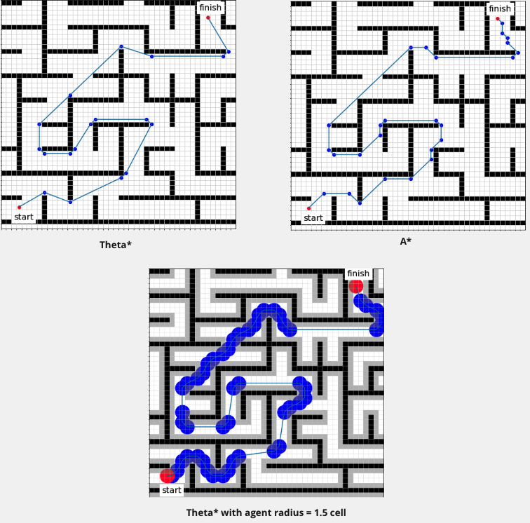
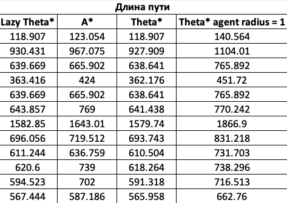
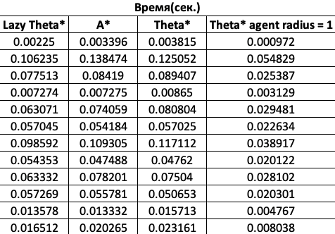
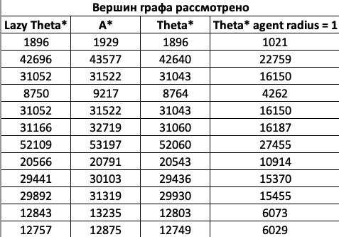

# PathPlanning 2021: Автоматическое планирование траектории
Алгоритмы планирования траектории.
Алгоритмы работают с картами в виде сетки(матрица из 0 и 1, где 0 - пустая клетка, а 1 - препятствие). Подразумевается,
что траектория агента проходит через центры клеток.
## Описание
В проекте реализованы следующие алгоритмы:
- A*
- theta*
- lazy theta*

theta* - модификация алгоритма A*. Главное отличие theta от A* в том, что в theta* родителем вершины может быть любая 
вершина, а в A* - только соседняя с текущей вершиной вершина. Это позволяет theta* поворачивать на любой угол.

На картинках представлены траектории, найденные алгоритмом A*, Theta*, а так же Theta* с радиусом агента, равным 1.5 длины клетки.
Видно, что на левой верхней картинке траектория содержит повороты на любые углы, а траектория справа сверху - только на 90 и 45 градусов,
из-за чего длина пути, найденного theta* меньше. На нижней картинке серым отмечены препятствия, раздутые на радиус клетки.
Видно, что агент с заданным радиусом на всем маршруте не пересекает препятствия.

lazy theta* - ленивая реализация Theta*: при добавлении соседа в OPEN алгоритм оптимистично предполагает, что сосед
виден из родителя текущей вершины. Предположение проверяется, когда происходит раскрытие этого соседа.

Расчет маршрута при заданном радиусе агента происходит благодаря препроцессингу карты: расширение препятствий на радиус 
агента. В результате чего получается новая карта, на которой запускается Theta*. Замер времени начинается после 
препроцессинга карты.

Результаты тестирования алгоритмов на картах размером 512 * 512, карты находятся в папке TestData. В четвертой колонке:
результаты работы алгоритма Theta* с радиусом агента, равным 1.

 
 

 
 

На всех тестах длина пути, рассчитанная алгоритмом A* оказалась больше длин, рассчитанных any-angle алгоритмами с 
радиусом агента 0. Длины путей, найденных тетой при радиусе агента = 1, превосходят все остальные по понятным причинам.
Lazy theta работает быстрее theta, но при этом создает больше вершин.

### Сборка и запуск

Сборка проекта осуществляется с помощью CMake. Код написан на C++20, перед запуском убедитесь в том, что Ваш компилятор
его поддерживает. Проект не использует сторонних библиотек.
Для запуска скомпилированного файла необходимо передать путь к входному файлу, формат которого описан ниже, в качестве
аргумента командной строки. Если входной файл корректен, краткий результат работы будет выведен в консоль, а также, по
умолчанию, будет создан log file с более детальной информацией.

### Входной файл
Структура входного файла

**\<root>** - корневой элемент, обязательный элемент. Состоит из элементов map, algorithm и
options. 
**\<map>** - карта, обязательный элемент. Содержит элементы width, height, cellsize, startx, starty,
finishx, finishy и grid. 
**\<width>** - ширина карты, обязательный элемент. Принимает целочисленные значения от 1 до
2∙10^9. 
**\<height>** - высота карты, обязательный элемент. Принимает целочисленные значения от 1 до
2∙10^9. 
**\<cellsize>** - длина стороны клетки в абсолютной величине (см, м, км), обязательный элемент. Принимает вещественные значения в полуинтервале (0; 1000]. 
**\<startx>** - абсцисса начальной точки, обязательный элемент. Принимает целочисленные значения в отрезке [0; **\<width>** - 1]. 
**\<starty>** - ордината начальной точки, обязательный элемент. Принимает целочисленные значения в отрезке [0; **\<height>** - 1]. 
**\<finishx>** - абсцисса конечной точки, обязательный элемент. Принимает целочисленные значения в отрезке [0; **\<width>** - 1]. 
**\<finishy>** - ордината конечной точки, обязательный элемент. Принимает целочисленные значения в отрезке [0; **\<height>** - 1]. 
**\<radius>** - радиус агента, необязательный элемент. Принимает целочисленные значения в отрезке [0; min(**\<height>**, **\<width>**)/2). По умолчанию равен 0. 
**\<grid>** - сетка карты, обязательный элемент. Содержит **\<height>** элементов row. 
**\<row>** - ряд сетки, обязательный элемент. Представляет собой одномерный массив длины **\<width>**
из 0 и 1, где 0 – свободная клетка, 1 – препятствие. 
**\<algorithm>** - алгоритм, обязательный элемент. Состоит из элементов searchtype, metrictype, hweight. 
**\<searchtype>** - тип поиска, необязательный элемент. Может принимать значения 'astar' - A*, 'thetastar' - theta* и 
'lazythetastar' – lazy theta*. Значение по умолчанию – theta*. 
**\<metrictype>** - тип метрики при расчете эвристики, необязательный элемент. Может принимать значения diagonal, manhattan, euclidean и chebyshev. Значение по умолчанию – euclidean.
Пусть есть точки a(x1, y1) и b(x2, y2). Тогда
diagonal(a, b) = 1.4 ∙ min(∆𝑥, ∆𝑦) + |∆𝑥 − ∆𝑦| manhattan(a, b) = ∆𝑥 + ∆𝑦
euclidean(a, b) = √(∆𝑥)2 + (∆𝑦)2 chebyshev(a, b) = max(∆𝑥, ∆𝑦) , где ∆𝑥 = |𝑥1 − 𝑥2|, ∆𝑦 = |𝑦1 − 𝑦2| 
**\<hweight>** - вес эвристики, необязательный элемент. Принимает вещественные значения в отрезке [0; 2 ∙ 10^9]. Значение по умолчанию = 1. 
**\<options>** - параметры логирования, обязательный элемент. Содержит элемент loglevel. 
**\<loglevel>** - вариант логирования, обязательный элемент. Принимает значения 0,5 – в выходном файле не будет содержаться карта с отмеченным на ней маршрутом и путь по точкам и по отрезкам, 1 – в выходном файле будет содержаться карта с отмеченным на ней маршрутом и путь по точкам и по отрезкам. 

### Выходной файл
Структура выходного файла

В выходном файле содержатся элементы, содержащиеся во входном файле, и элементы, описанные ниже. 
**\<log>** - результат логирования, обязательный элемент. Состоит из элементов mapfilename, summary, path, lplevelи hplevel. 
**\<mapfilename>** - относительный путь до входного файла, обязательный элемент. Принимает текстовое значение пути файла. 
**\
** - описание работы алгоритма, обязательный элемент. Содержит атрибуты numberofsteps, nodescreated, length, length_scaled, time. 
**\<numberofsteps>** - количество итераций цикла, обязательный атрибут. Принимает целочисленные значения в отрезке [0; 2*10^9]. 
**\<nodescreated>** - количество созданных node’ов, обязательный атрибут. Принимает целочисленные значения в отрезке [0; 2*10^9]. 
**\<length>** - относительная длина пути, обязательный атрибут. Принимает вещественные значения в отрезке [0; 2*10^9]. 
**\<length_scaled>** - абсолютная длина пути, обязательный атрибут. Принимает вещественные значения в отрезке [0;2*10^9]. 
**\<time>** - время поиска пути в секундах, обязательный атрибут. Принимает вещественные значения в отрезке [0; 2*10^9]. 
**\<path>** - сетка с путём, необязательный элемент. По умолчанию пустой. Если значение <loglevel> = 1, состоит из <height> элементов row. 
**\<row>** - ряд сетки с путем, обязательный элемент. Содержит атрибут number. Представляет собой одномерный массив длины <width> из *, 
0, 1 и 2, где * - клетка, по которой проходит найденный путь, 0 – свободная клетка, 1 – препятствие, 2 - раздутое в результате препроцессинга карты препятствие. 
**\<number>** - номер ряда сетки, обязательный атрибут. Принимает целочисленные значения в отрезке [0; <height> - 1]. 
**\<lplevel>** - описание пути по точкам, необязательный элемент. По умолчанию пустой. Если значение <loglevel> = 1, состоит из элементов node. 
**\<node>** - точка пути, обязательный элемент. Состоит из атрибутов x, y, number. 
**x** - абсцисса точки, обязательный атрибут. Принимает целочисленные значения в отрезке [0; <width> - 1]. 
**y** - ордината точки, обязательный атрибут. Принимает целочисленные значения в отрезке [0; <height> - 1]. 
**number** - порядковый номер в пути, обязательный атрибут. Принимает целочисленные значения в отрезке [0; 2*10^9]. 
**\<hplevel>** - описание пути по отрезкам, необязательный элемент. По умолчанию пустой. Если значение <loglevel> = 1, состоит из элементов section. 
**\<section>** - отрезок, обязательный элемент. Состоит из атрибутов number, start.x, start.y, finish.x, finish.y, length. 
**number** - порядковый номер отрезка в пути, обязательный атрибут. Принимает целочисленные значения в отрезке [0; 2*10^9]. 
**start.x** – абсцисса начала отрезка, обязательный атрибут. Принимает целочисленные значения в отрезке [0; <width> - 1]. 
**start.y** – ордината начала отрезка, обязательный атрибут. Принимает целочисленные значения в отрезке [0; <height> - 1]. 
**finish.x** – абсцисса конца отрезка, обязательный атрибут. Принимает целочисленные значения в отрезке [0; <width> - 1]. 
**finish.y** – ордината конца отрезка, обязательный атрибут. Принимает целочисленные значения в отрезке [0; <height> - 1]. 
**length** – относительная длина отрезка, обязательный атрибут. Принимает вещественные значения в отрезке [0; 2*10^9]. 

## Визуализатор
В папке Visualization лежит блокнот, который можно открыть в Google Colab или Jupiter Notebook. Он получает на вход
текстовый файл map.txt и рисует карту и путь. Файл генерируется при допустимых значениях тега **\<loglevel>** от 1 и 
выше в текущей директории.
## Литература
- K. Daniel, A.Nash, S.Koenig, A.Felner, Theta*: Any-Angle Path Planning on Grids [Электронный ресурс] : Journal of Artificial Intelligence Research  / K. Daniel, A.Nash, S.Koenig, A.Felner —Электрон. журн.— США: Morgan Kaufmann Publishers, 1.05.2016.: 10.01.2014. — URL: https://www.researchgate.net/publication/259764504_Theta_Any-Angle_Path_Planning_on_Grids. (дата обращения: 25.04.2022)
## Контакты
**Рахматуллин Карим Ильдарович**
- kirakhmatullin@edu.hse.ru
