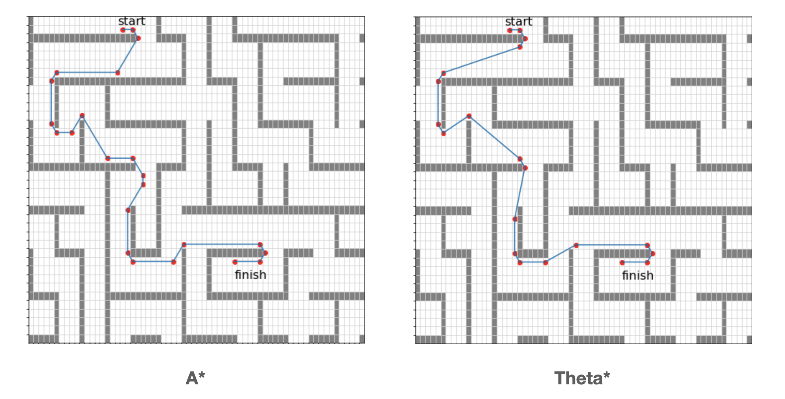
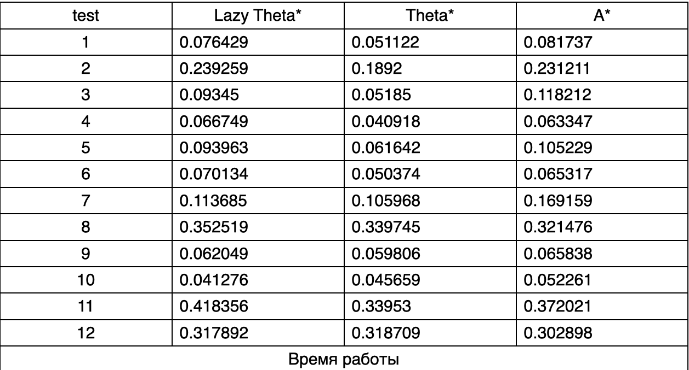

# PathPlanning 2021: Автоматическое планирование траектории
Алгоритмы планирования траектории.
Алгоритмы работают с картами в виде сетки(матрица из 0 и 1, где 0 - пустая клетка, а 1 - препятствие). Подразумевается,
что траектория агента проходит через центры клеток.
## Описание
В проекте реализованы следующие алгоритмы:
- A*
- theta*
- lazy theta*-P

theta* - модификация алгоритма A*. Главное отличие theta от A* в том, что в theta* родителем вершины может быть любая 
вершина, а в A* - только соседняя с текущей вершиной вершина. Это позволяет theta* поворачивать на любой угол.

На картинках представлены траектории, найденные алгоритмом A* и Theta*. Видно, что траектория слева содержит повороты на
90 и 45 градусов, а траектория справа - на любые углы, из-за чего длина пути, найденного theta* меньше.

lazy theta*-P - ленивая реализация Theta*: при добавлении соседа в OPEN алгоритм пессимистично предполагает, что сосед
не виден из родителя текущей вершины. Предположение проверяется, когда происходит раскрытие этого соседа.

Результаты тестирования алгоритмов на карте размером 512 * 512

 
 

 
 

На всех тестах длина пути, рассчитанная алгоритмом A* оказалась больше, длины путей, рассчитанных any-angle алгоритмами
почти равны между собой. Аналогичная ситуация наблюдается со временем. По третьей таблице можно заметить, что
ленивая реализация теты создает больше вершин.

### Сборка и запуск

Сборка проекта осуществляется с помощью CMake. Код написан на C++20, перед запуском убедитесь в том, что Ваш компилятор
его поддерживает. Проект не использует сторонних библиотек.
Для запуска скомпилированного файла необходимо передать путь к входному файлу, формат которого описан ниже, в качестве
аргумента командной строки. Если входной файл корректен, краткий результат работы будет выведен в консоль, а также, по
умолчанию, будет создан log file с более детальной информацией.

### Входной файл
Структура входного файла

**\<root>** - корневой элемент, обязательный элемент. Состоит из элементов map, algorithm и
options. 
**\<map>** - карта, обязательный элемент. Содержит элементы width, height, cellsize, startx, starty,
finishx, finishy и grid. 
**\<width>** - ширина карты, обязательный элемент. Принимает целочисленные значения от 1 до
2∙10^9. 
**\<height>** - высота карты, обязательный элемент. Принимает целочисленные значения от 1 до
2∙10^9. 
**\<cellsize>** - длина стороны клетки в абсолютной величине (см, м, км), обязательный элемент. Принимает вещественные значения в полуинтервале (0; 1000]. 
**\<startx>** - абсцисса начальной точки, обязательный элемент. Принимает целочисленные значения в отрезке [0; **\<width>** - 1]. 
**\<starty>** - ордината начальной точки, обязательный элемент. Принимает целочисленные значения в отрезке [0; **\<height>** - 1]. 
**\<finishx>** - абсцисса конечной точки, обязательный элемент. Принимает целочисленные значения в отрезке [0; **\<width>** - 1]. 
**\<finishy>** - ордината конечной точки, обязательный элемент. Принимает целочисленные значения в отрезке [0; **\<height>** - 1]. 
**\<grid>** - сетка карты, обязательный элемент. Содержит **\<height>** элементов row. 
**\<row>** - ряд сетки, обязательный элемент. Представляет собой одномерный массив длины **\<width>**
из 0 и 1, где 0 – свободная клетка, 1 – препятствие. 
**\<algorithm>** - алгоритм, обязательный элемент. Состоит из элементов searchtype, metrictype, hweight. 
**\<searchtype>** - тип поиска, необязательный элемент. Может принимать значения 'astar' - A*, 'thetastar' - theta* и 
'lazythetastar' – lazy theta*-P. Значение по умолчанию – theta*. 
**\<metrictype>** - тип метрики при расчете эвристики, необязательный элемент. Может принимать значения diagonal, manhattan, euclidean и chebyshev. Значение по умолчанию – euclidean.
Пусть есть точки a(x1, y1) и b(x2, y2). Тогда
diagonal(a, b) = 1.4 ∙ min(∆𝑥, ∆𝑦) + |∆𝑥 − ∆𝑦| manhattan(a, b) = ∆𝑥 + ∆𝑦
euclidean(a, b) = √(∆𝑥)2 + (∆𝑦)2 chebyshev(a, b) = max(∆𝑥, ∆𝑦) , где ∆𝑥 = |𝑥1 − 𝑥2|, ∆𝑦 = |𝑦1 − 𝑦2| 
**\<hweight>** - вес эвристики, необязательный элемент. Принимает вещественные значения в отрезке [0; 2 ∙ 10^9]. Значение по умолчанию = 1. 
**\<options>** - параметры логирования, обязательный элемент. Содержит элемент loglevel. 
**\<loglevel>** - вариант логирования, обязательный элемент. Принимает значения 0,5 – в выходном файле не будет содержаться карта с отмеченным на ней маршрутом и путь по точкам и по отрезкам, 1 – в выходном файле будет содержаться карта с отмеченным на ней маршрутом и путь по точкам и по отрезкам. 

## Литература
- K. Daniel, A.Nash, S.Koenig, A.Felner, Theta*: Any-Angle Path Planning on Grids [Электронный ресурс] : Journal of Artificial Intelligence Research  / K. Daniel, A.Nash, S.Koenig, A.Felner —Электрон. журн.— США: Morgan Kaufmann Publishers, 1.05.2016.: 10.01.2014. — URL: https://www.researchgate.net/publication/259764504_Theta_Any-Angle_Path_Planning_on_Grids. (дата обращения: 25.04.2022)
## Контакты
**Рахматуллин Карим Ильдарович**
- kirakhmatullin@edu.hse.ru
